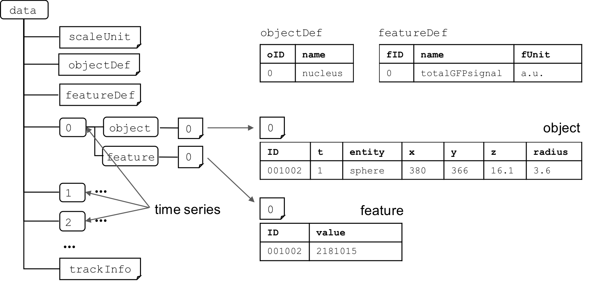

# BDML-BD5 Overview
BDML-BD5 is a set of open data formats for representing quantitative data of biological dynamics. While BDML is an XML based format, BD5 is based on HDF5 binary format (ref: https://portal.hdfgroup.org/display/HDF5/HDF5).

## Motivation
Rapid advances in live-cell imaging and modeling techniques enable many research groups to obtain a huge amount of quantitative biological dynamics data on spatiotemporal dynamics of biological objects such as molecules, cells, and organisms. However, these data cannot often be compared and analyzed by the same software tools because of different data formats. BDML (Biological Dynamics Markup Language) aims to facilitate data exchange and development of software tools for data visualization and analysis. 

Because BDML is an XML-based data format, large resources are required to read a whole BDML file sequentially into computer memory; this makes it difficult to access quantitative data when the file size is large. In contrast, BD5 enables fast random access to quantitative data on disk without parsing the entire file, and thereby allows practical reuse of data for understanding biological dynamics.

# BDML
BDML is XML based data format for representing quantitative biological dynamics data. It can represent both meta and numerical information in a single file. 

BDML schema and specification: <http://ssbd.qbic.riken.jp/bdml/>   

# BD5
BD5 is an HDF5-based binary data format. It was developed to support BDML for storing numerical quantitative biological dynamics data when the data set becomes too large. It allows fast random access to the data.

BD5 specification:

 BD5 has one container named *data* group. It includes
  * *scaleUnit* dataset for the definition of spatial and time scale and unit,
  * *objectDef* dataset for the definition of biological objects,
  * *featureDef* dataset for features of interest,
  * numbered groups (0, 1, ..., n) corresponding to the number in time series,
  * *trackInfo* dataset for the information of tracking of one object to another.

In *scaleUnit* dataset, spatial and time scale and unit is defined. 
* *dimension* should be described by one of the following labels: 
  * "0D", 
  * "1D", 
  * "2D", 
  * "3D", 
  * "0D+T", 
  * "1D+T", 
  * "2D+T" or 
  * "3D+T". 
* It is followed by *dimension*, *xScale*, *yScale*, *zScale* and *sUnit*. 
* In the case of time series data, *tScale* and *tUnit* should be defined.

|dimension |xScale |yScale |zScale |sUnit      |tScale |tUnit  |
|:---------|-------|-------|-------|-----------|-------|-------|
|3D+T      |0.5    |0.5    |1.0    |micrometer |1.0    |second |

In *objectDef* dataset, biological objects of interest are defined.

|oID   |name    |
|:-----|--------|
|0     |nucleus |

In *featureDef* dataset, features of interest are defined.

|fID   |name           |fUnit    |
|:-----|---------------|---------|
|0     |totalGFPsignal |a.u.     |

Each numbered group consists of two groups, *object* and *feature* groups. 
* Each *object* group has numbered dataset(s) corresponding to the reference number of the biological object predefined in the *objectDef* dataset. 
* Each row of a numbered object includes the ID of the object and the spatiotemporal information of the object. 
* In the current version of BD5, it allows five entities, "point, "circle", "sphere", "line" and "face". 
 * "point" entity - each row of a numbered object includes time and xyz (or xy or x) coordinates. 
 * "circle" or "sphere" entity - each row includes time and xyz (or xy) coordinates. 
 * "line" or "face" entity - each row includes time, xyz (or xy) coordinates, and *seqID*. 
  * The *seqID* represents the ID of sequence of xyz coordinates. A set of regions or surfaces connected by xyz coordinates having the same *seqID*  represents the spatial information of the object.

|ID    |t  |entity  |x    |y    |z    |radius   |
|:-----|---|--------|-----|-----|-----|---------|
|i001  |0  |sphere  |3.4  |4.5  |1.4  |3.6      |

In *trackInfo* dataset, the information of tracking of one object to another is described. Each row includes *from* and *to* corresponding to the IDs at the neighboring time.

|from  |to   |
|:-----|-----|
|i001  |i002 |

## Program codes
Software tools for data visualization and analysis are available at <http://ssbd.qbic.riken.jp/software/>.

Jupyter Notebook for accessing BD5 format are also available as follows:

1. <https://github.com/openssbd/BDML-BD5/blob/master/BD5_Displacement.ipynb>  
2. <https://github.com/openssbd/BDML-BD5/blob/master/BD5_ProliferationCurve.ipynb>

## Reference
Koji Kyoda, Yukako Tohsato, Kenneth H.L. Ho, Shuichi Onami (2015) Biological Dynamics Markup Language (BDML): an open format for representing quantitative biological dynamics data. *Bioinformatics* **31**, 1044-1052. https://doi.org/10.1093/bioinformatics/btu767
